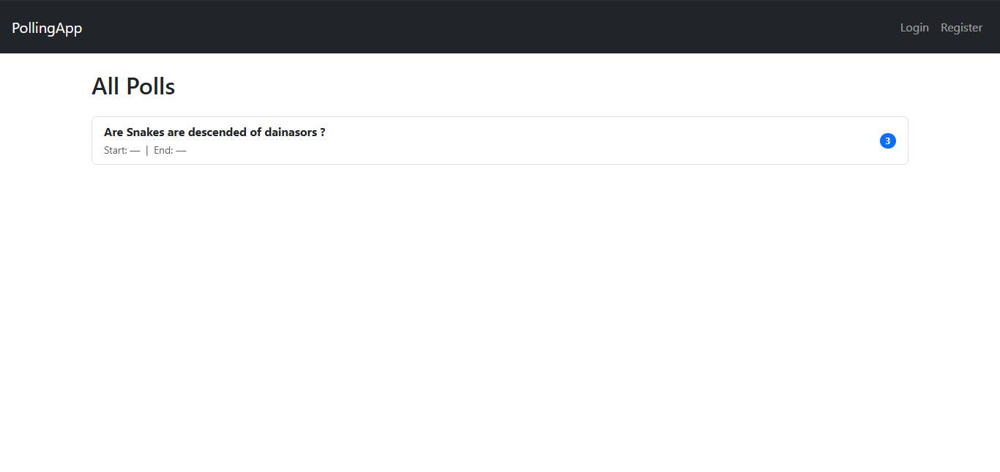
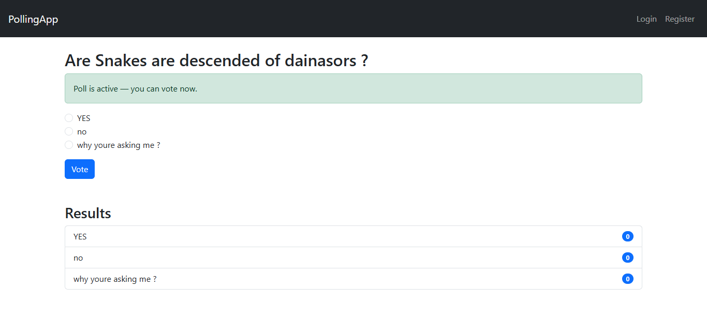
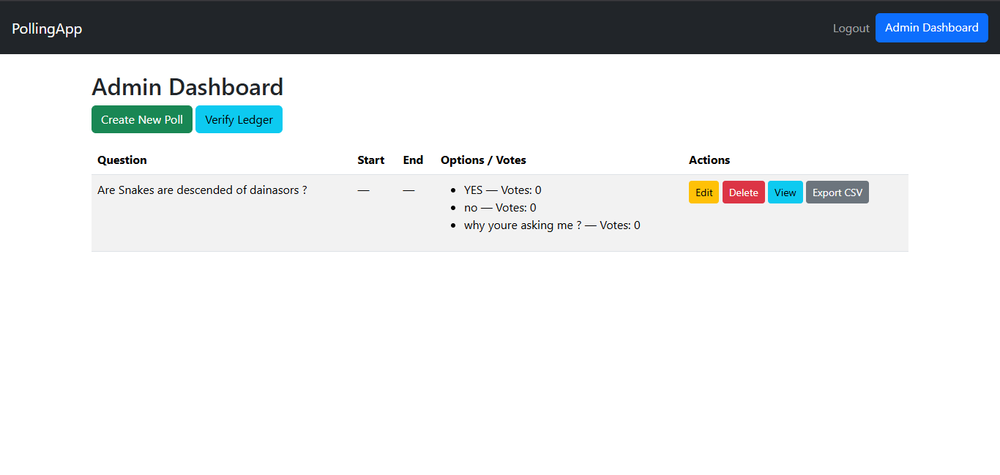

# 🔐 Secure Polling App — Flask + SQLAlchemy + Encryption + Docker


[](https://www.python.org/downloads/)
[](https://flask.palletsprojects.com/)
[](https://www.docker.com/)
[](LICENSE)
[](http://makeapullrequest.com)

---

This application allows users to vote once per poll, with encrypted vote storage and admin management, including poll creation and expiration logic.

## 🛠️ Tech Stack

**Backend:**
- Flask (Python Web Framework)
- SQLAlchemy (ORM)
- Flask-Login (Authentication)
- Flask-WTF (CSRF Protection)
- Gunicorn (WSGI Server)

**Security:**
- Fernet Encryption (Vote Privacy)
- CSRF Protection
- Password Hashing (Werkzeug)
- Blockchain-style Vote Ledger

**DevOps:**
- Docker & Docker Compose
- Kubernetes-ready
- Volume-based Persistence
- Health Check Endpoints

## 📸 Screenshots

   ### Homepage
   

   ### Voting Interface
   

   ### Admin Dashboard
   


---

## 🚀 Features

| Feature | Status |
|--------|--------|
| Create polls (admin only) | ✅ |
| Vote once per poll (browser cookie & hash check) | ✅ |
| SQLAlchemy database model (SQLite volume) | ✅ |
| Encrypted voting using Fernet | ✅ |
| Secret stored outside codebase | ✅ |
| Key changes when container is re-created(unless same volumes are used) | ✅ |
| WSGI (Gunicorn) for production | ✅ |
| Docker & Docker Compose setup | ✅ |
| Kubernetes-ready deployment flow | ✅ |

---

## 📂 Project Structure

```

poll_app/
│
├── app.py
├── wsgi.py
├── models.py
├── utils.py
├── admin.py
├── poll_blueprint.py
├── requirements.txt
├── entrypoint.sh
├── Dockerfile
├── docker-compose.yml
├── gunicorn.conf.py
│
├── templates/
├── static/
│
└── data/   (Docker volume mount)
    ├── poll_encryption_key
    ├── polls.db
    └── ledger.jsonl 

```

---

## 🔑 Security Model

### ✔ Vote Encryption

Votes are encrypted using **Fernet symmetric encryption**.  
The encryption key:

- Is **not stored in code**
- Is mounted at runtime via secrets
- Can rotate safely if using MultiFernet mode

### ✔ One-Vote Enforcement

Users can vote only once using:

- Browser cookie identifier
- Optional secondary validation (e.g., hashed IP or session-tied signature)

### ✔ Admin Authentication

Admin credentials are set through environment variables:

```

ADMINU=admin
ADMINP=adminpass

````

---

## 🧰 Installation (Local)

### 1. Create venv

```sh
python -m venv venv
source venv/bin/activate
pip install -r requirements.txt
````
### 2. Generate Encryption Key (Local Development Only)

For local development, create a data directory:
```sh
mkdir -p data
python - <<EOF
from cryptography.fernet import Fernet
with open('data/poll_encryption_key', 'wb') as f:
    f.write(Fernet.generate_key())
EOF
```

**Note:** When running with Docker, this is handled automatically by `entrypoint.sh`

---

## 🐳 Running With Docker

### Build & Run

```sh
docker-compose up --build
```

App runs at:

➡ [http://localhost:5000](http://localhost:5000)

### Persistent Data

* SQLite DB stored in a Docker volume
* Encryption key stored in mounted in same volume

---

## 🛠 Dockerfile (Production-ready)

* Uses **python:3.11-slim**
* Runs under **Gunicorn WSGI**
* `entrypoint.sh` creates or loads the encryption key and makes admin

---

## 🔧 Entrypoint Behavior

On first run:

* Generates a new encryption key and admin account
* Saves it to mounted secret path

On subsequent restarts:

* Reuses the persisted key
* same volumes use same key due to reusability


This supports:

| Deployment                    | Result            |
| ----------------------------- | ----------------- |
| Restart Same container with same volume | Same key retained |
| Restart new container same volume | Same key retained |
| Restart with new volume | New key generated |

---

## ☸ Kubernetes Deployment (Optional)

Workflow:

1. Push image to registry
2. Create Kubernetes Secret:

```sh
kubectl create secret generic poll-encryption-key \
  --from-file=poll_encryption_key=secrets/poll_encryption_key
```

3. Apply Deployment + PVC + Service
4. Expose via Ingress + HTTPS

---

## 🧪 Environment Variables

| Variable                   | Purpose                    |
| -------------------------- | -------------------------- |
| `SECRET_KEY`               | Flask session secret key   |
| `ADMINU`                   | Built-in admin username    |
| `ADMINP`                   | Built-in admin password    |
| `FLASK_ENV`                | development / production   |
| `POLL_ENCRYPTION_KEY`      | (Optional) Encryption key  |

---

## 🔧 WSGI

Application entry point is:

```
wsgi:app
```

This makes the app compatible with:

* Gunicorn
* uWSGI
* Nginx reverse proxy stacks

---

## 📦 Requirements

```
Flask
Flask-SQLAlchemy
Flask-Login
Flask-Migrate
cryptography
Flask-WTF
WTForms
python-dotenv
gunicorn
```

---

## 👥 Contributing

1. Fork
2. Create feature branch
3. Submit Pull Request

PRs should follow:

* Secure coding practices
* Stateless container principles
* Configurable secrets — **never committed keys**
---

## 🔧 Troubleshooting

### Container fails to start
- Check Docker logs: `docker-compose logs -f`
- Ensure `/data` directory has proper permissions
- Verify environment variables are set

### Admin login not working
- Check `ADMINU` and `ADMINP` environment variables
- Remove `/data/admin_created` to recreate admin: `docker-compose exec poll-app rm /data/admin_created`
- Restart container: `docker-compose restart`

### Votes not being encrypted
- Check if encryption key exists: `docker-compose exec poll-app ls -la /data/poll_encryption_key`
- Verify file permissions on `/data` directory

### Database errors
- Reset database: change volume(because databse is stored in it) and re-create container

---

## 🚀 Quick Start Guide

### 1. Start the application
`````sh
docker-compose up --build
`````

### 2. Access the application
Open your browser to [http://localhost:5000](http://localhost:5000)

### 3. Login as admin
- Username: `admin` (or whatever you set in `ADMINU`)
- Password: `adminpass` (or whatever you set in `ADMINP`)

### 4. Create your first poll
1. Click "Admin Dashboard"
2. Click "Create New Poll"
3. Enter question and options
4. Set start/end times (optional)
5. Click "Create Poll"

### 5. Vote on a poll
1. Navigate to homepage
2. Click on a poll
3. Select your choice
4. Submit vote

---

## 🛡 License

MIT License

---

---

## 🙌 Credits

Built and iterated via architectural planning including:

* Encryption key security best practices
* Dockerized deployment
* Kubernetes-ready secret management
* Poll expiration logic
* Secure one-vote enforcement

---

> Ready to deploy. Secure by design. Cloud-scalable.