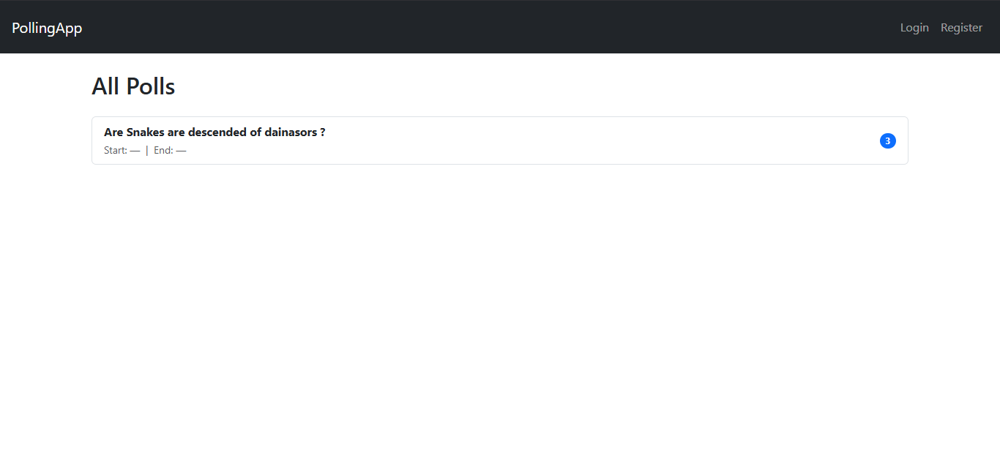
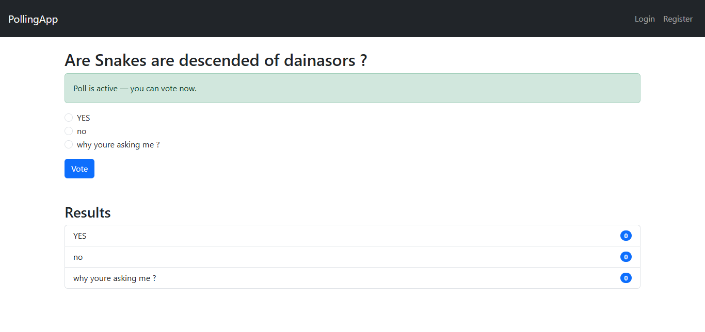
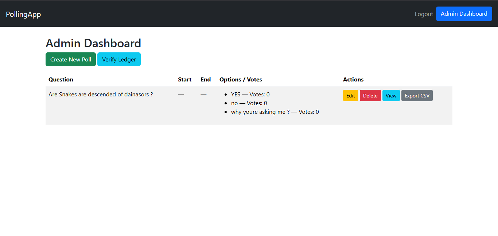
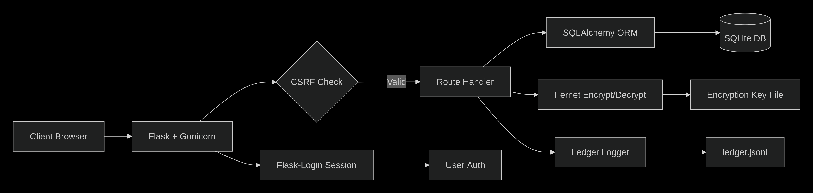

<h1 align="center">🔐 Secure Polling App</h1>
<h3 align="center">Enterprise-Grade Voting System with Cryptographic Privacy & Blockchain Audit Trail</h3>

<p align="center">
  <i>Built for developers who demand security, scalability, and simplicity — wrapped in a beautiful Flask interface.</i>
</p>

<p align="center">
  <strong>Zero-trust voting infrastructure • End-to-end encryption • One-vote enforcement • Production-ready</strong>
</p>
<p align="center">
  
  
  
</p>

---

## 📑 Table of Contents

- [Overview](#-overview)
- [Why This Exists](#-why-this-exists)
- [Features](#-features)
- [Screenshots](#-screenshots)
- [Tech Stack](#-tech-stack)
- [Quick Start](#-quick-start)
- [Configuration](#-configuration)
- [How It Works](#-how-it-works)
- [Project Structure](#-project-structure)
- [Security Deep Dive](#-security-deep-dive)
- [Deployment](#-deployment)
- [Contributing](#-contributing)
- [License](#-license)

---

## 💡 Overview

**Secure Polling App** is a full-stack voting platform where every vote is encrypted, every user is verified, and every action is audited. Built for privacy-first organizations, hackathons, and developers who need a reference implementation of secure Flask architecture.

### 🎯 What it does
- Create time-bound polls (admin only)
- Vote once per poll (enforced by user ID, IP, or cookie)
- Store votes encrypted with Fernet
- Track all votes in a blockchain-style ledger
- Live admin dashboard with poll management

### 🔥 Why this exists
**The Problem:** Most polling apps store votes in plaintext, allow duplicate voting, and have no audit trail.

**The Solution:** A voting system that combines **cryptographic encryption**, **multiple vote-tracking mechanisms**, and **tamper-proof ledger** — all running in Docker with Kubernetes support.

### 👥 Who it's for
| Audience | Value |
|----------|-------|
| Developers | Reference architecture for secure Flask + SQLAlchemy |
| Security Engineers | Zero-trust voting with Fernet + ledger hashing |
| DevOps Teams | Docker + K8s ready, secrets management, health checks |
| Product Owners | Deploy private polls in 2 minutes |

---

## ✨ Features

<table>
<tr>
<td width="50%">

#### 🔐 **Privacy by Design**
- Votes encrypted with **Fernet (symmetric encryption)**
- Encryption key stored **outside codebase** (mounted secret)
- No plaintext vote storage — ever

#### 🛡️ **Multi-Layer Vote Enforcement**
- **Authenticated users:** `user_id` unique constraint
- **Anonymous users:** `ip_address` + browser cookie
- Both checks required for anonymous voting

#### 🧾 **Blockchain Audit Trail**
- Every vote logged in `ledger.jsonl`
- SHA256 hashing + previous hash linking
- **Tamper-evident:** cannot modify past votes

</td>
<td width="50%">

#### ⚡ **Production-Ready Stack**
- **Flask 3.0** + SQLAlchemy ORM
- **Gunicorn** WSGI server
- **Docker Compose** + Kubernetes manifests
- Volume persistence for DB, keys, ledger

#### 🧪 **Security Hardened**
- CSRF protection on all POST endpoints
- Password strength validation (8+ chars, uppercase, lowercase, digit)
- HTML escaping via `markupsafe` (XSS prevention)
- Admin-only decorator on sensitive routes

#### 🐳 **Zero-Config DevOps**
- `docker-compose up --build` = fully running app
- Entrypoint auto-generates encryption key
- Admin account auto-created from env vars
- Health check endpoint included

</td>
</tr>
</table>

---

## 📸 Screenshots

<p align="center">
  <table>
    <tr>
      <td align="center"><b>🏠 Homepage</b><br></td>
      <td align="center"><b>🗳️ Voting Interface</b><br></td>
      <td align="center"><b>📊 Admin Dashboard</b><br></td>
    </tr>
  </table>
</p>

---

## 🛠️ Tech Stack

| Category | Technology | Purpose |
|----------|------------|---------|
| **Backend** | Flask 3.0 | Web framework & routing |
| | SQLAlchemy | ORM for SQLite (with volume persistence) |
| | Flask-Login | Session-based user authentication |
| | Flask-WTF | CSRF token protection |
| **Security** | Cryptography (Fernet) | Vote encryption & decryption |
| | Werkzeug | Password hashing (PBKDF2) |
| | Markupsafe | HTML escaping (XSS prevention) |
| **Server** | Gunicorn | Production WSGI server |
| **DevOps** | Docker Compose | Local orchestration |
| | Kubernetes | Cloud deployment ready |
| **Monitoring** | Health check endpoint | Container liveness probes |

---

## ⚡ Quick Start

### Prerequisites
- Python 3.11+
- Docker & Docker Compose (recommended)
- Git

### 🐳 Run with Docker (Recommended)

```bash
# Clone the repository
git clone https://github.com/mdskun/secure-polling-app.git
cd secure-polling-app

# Create .env file
cat > .env << EOF
SECRET_KEY=your-super-secret-key-change-this
ADMINU=admin
ADMINP=YourSecurePass123
FLASK_ENV=production
EOF

# Build and run
docker-compose up --build
```

**Access the app:** [http://localhost:5000](http://localhost:5000)

### 🖥️ Local Development Setup

```bash
# Create virtual environment
python -m venv venv
source venv/bin/activate  # Windows: venv\Scripts\activate

# Install dependencies
pip install -r requirements.txt

# Generate encryption key
mkdir -p data
python -c "from cryptography.fernet import Fernet; open('data/poll_encryption_key', 'wb').write(Fernet.generate_key())"

# Set environment variables
export SECRET_KEY="your-secret-key"
export ADMINU="admin"
export ADMINP="adminpass"

# Run Flask development server
python app.py
```

---

## ⚙️ Configuration

### Environment Variables

| Variable | Required | Default | Description |
|----------|----------|---------|-------------|
| `SECRET_KEY` | ✅ | — | Flask session signing key |
| `ADMINU` | ✅ | — | Built-in admin username |
| `ADMINP` | ✅ | — | Built-in admin password |
| `FLASK_ENV` | ❌ | `production` | `development` or `production` |
| `POLL_ENCRYPTION_KEY` | ❌ | (file-based) | Fernet key (alternative to mounted file) |

### Volume Persistence (Docker)

| Volume Mount | Purpose | Persisted |
|--------------|---------|------------|
| `./data/polls.db` | SQLite database | ✅ All polls, users, votes |
| `./data/poll_encryption_key` | Fernet encryption key | ✅ Key survives restarts |
| `./data/ledger.jsonl` | Audit trail | ✅ Complete vote history |

---

## 🔄 How It Works

### User Flow

```
1. User registers → Password validation + hashing → Stored in SQLite
2. Admin creates poll → Question + options + expiration → Encrypted metadata
3. User votes → Vote encrypted with Fernet → Stored + Ledger entry created
4. System prevents re-vote → Checks user_id OR ip_address+cookie
5. Admin views results → Decrypts votes on demand → Dashboard shows aggregates
```

### Internal Architecture



### Vote Encryption Flow

```
Plaintext vote → Fernet.encrypt() → Encrypted bytes → Base64 encode → Store in DB
```

**Key management:** Read from `/data/poll_encryption_key` or `POLL_ENCRYPTION_KEY` env var.

---

## 📂 Project Structure

```
secure-polling-app/
│
├── 🚀 Entry Points
│   ├── app.py                 # Flask factory & app creation
│   ├── wsgi.py                # Gunicorn entry point
│   └── entrypoint.sh          # Docker init (key gen + admin creation)
│
├── 🧠 Core Logic
│   ├── models.py              # SQLAlchemy models (User, Poll, Vote)
│   ├── utils.py               # Fernet encryption + thread-safe ledger
│   ├── admin.py               # Admin dashboard blueprint
│   ├── auth.py                # Login/register blueprint
│   └── poll_blueprint.py      # Voting & poll listing
│
├── 🎨 Frontend
│   ├── templates/             # 8+ Jinja2 templates
│   │   ├── base.html          # Layout with CSRF macros
│   │   ├── admin_dashboard.html
│   │   └── ...
│   └── static/style.css       # Responsive design
│
├── 🐳 DevOps
│   ├── Dockerfile             # Multi-stage (slim image)
│   ├── docker-compose.yml     # Volume + env + healthcheck
│   ├── gunicorn.conf.py       # Worker tuning
│   └── requirements.txt       # Pinned dependencies
│
└── 💾 Data (volume mounted)
    ├── polls.db               # SQLite database
    ├── poll_encryption_key    # Fernet key (auto-generated)
    └── ledger.jsonl           # Blockchain audit trail
```

### Key Modules Explained

| Module | Responsibility | Security Notes |
|--------|---------------|----------------|
| `utils.py` | Fernet encryption + ledger append | Thread-safe with mutex lock |
| `models.py` | DB schema + vote constraints | Unique constraints on (poll_id, user_id) |
| `admin.py` | Poll CRUD + result viewing | `@admin_only` decorator |
| `auth.py` | Registration + login | Password validation + hashing |
| `poll_blueprint.py` | Voting logic | IP + cookie tracking for anonymous |

---

## 🔒 Security Deep Dive

### Encryption at Rest

```python
# Encryption
cipher = Fernet(key)
encrypted_vote = cipher.encrypt(vote_text.encode())

# Decryption (admin only)
decrypted = cipher.decrypt(encrypted_vote).decode()
```

**Key security properties:**
- AES-128 in CBC mode with PKCS7 padding
- Key never logged or exposed in error messages
- Rotation ready via MultiFernet

### One-Vote Enforcement Matrix

| User Type | Primary Check | Secondary Check | Database Constraint |
|-----------|--------------|----------------|---------------------|
| Authenticated | `user_id` | — | `UniqueConstraint('poll_id', 'user_id')` |
| Anonymous | `ip_address` | Cookie ID | `UniqueConstraint('poll_id', 'ip_address')` |

**Why two checks for anonymous?** IP-only can block entire networks (schools, offices). Cookie ensures individual browsers can vote even behind shared IP.

### Blockchain Ledger Format

```json
{
  "index": 42,
  "timestamp": "2024-01-15T10:30:00Z",
  "poll_id": 5,
  "user_id": null,
  "ip_hash": "sha256...",
  "vote_hash": "sha256...",
  "previous_hash": "abc123...",
  "hash": "def456..."
}
```

**Tamper detection:** Changing any field breaks the chain — previous hash mismatch detected on audit.

---

## ☸️ Deployment

### Docker Compose (Production)

```bash
docker-compose -f docker-compose.yml up -d
```

<!-- ### Kubernetes (Optional)

```bash
# Build and push image
docker build -t your-registry/polling-app:1.1 .
docker push your-registry/polling-app:1.1

# Create secrets
kubectl create secret generic poll-secrets \
  --from-literal=SECRET_KEY=your-key \
  --from-literal=ADMINU=admin \
  --from-literal=ADMINP=securepass

# Deploy (manifests not included, create your own)
kubectl apply -f k8s/deployment.yaml
kubectl apply -f k8s/service.yaml
kubectl apply -f k8s/ingress.yaml
``` -->

### Environment Checklist

- [ ] Change `SECRET_KEY` in production
- [ ] Set strong `ADMINP` (12+ chars, special chars)
- [ ] Mount encryption key from secret manager (not env)
- [ ] Enable HTTPS (Ingress + cert-manager)
- [ ] Set `FLASK_ENV=production`
- [ ] Configure database backups for `polls.db`

---

## 🤝 Contributing

We welcome security researchers, Flask developers, and DevOps engineers.

---

## 📄 License

Distributed under the **MIT License**. See `LICENSE` for more information.

---

## 👨‍💻 Author & Credits

**Manthan D Soni**

[](https://github.com/mdskun)
[](mailto:manthandsoni@gmail.com)

---

<p align="center">
  <b>🔐 Secure by design. Verified by code. Battle-tested in containers.</b><br>
  <sub>Questions? Issues? PRs welcome — let's build better voting infrastructure.</sub>
</p>
