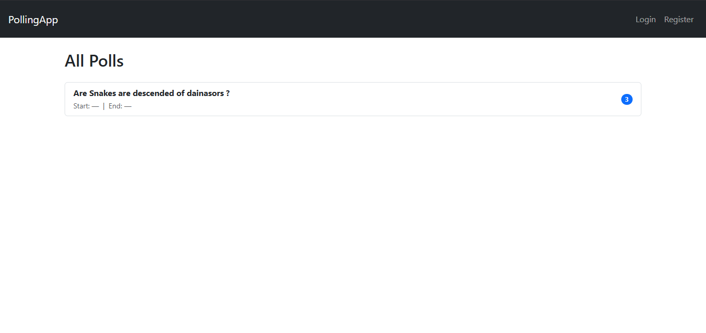
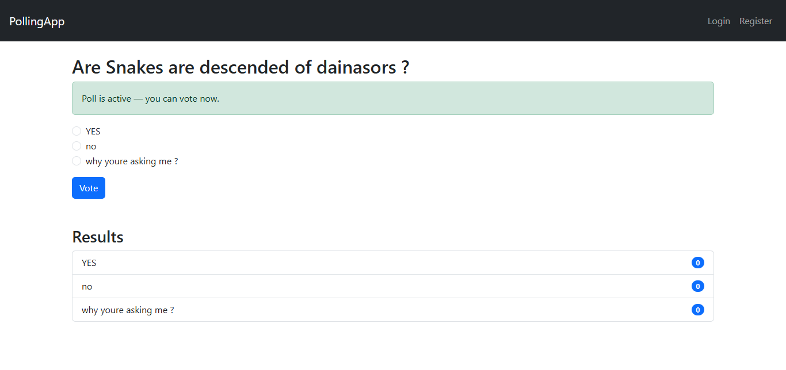
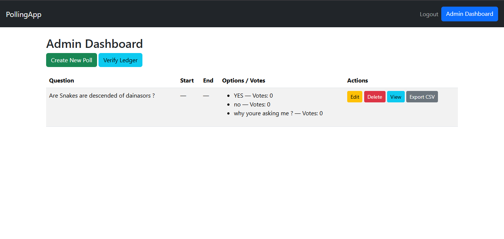
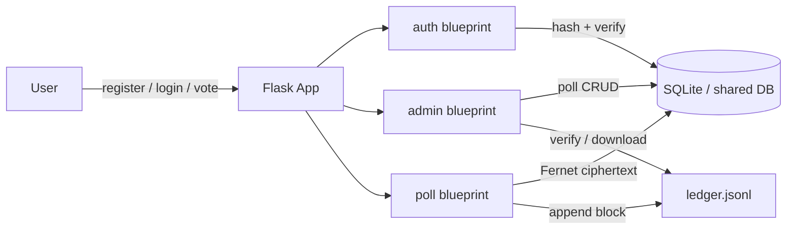

<h1 align="center">🔐 Secure Polling App</h1>
<h3 align="center">Cryptographically Private Voting with Encrypted Ballots &amp; a Hash-Chained Audit Ledger</h3>

<p align="center">
  <i>A production-grade Flask voting platform where every vote is encrypted, every voter is verified, and every submission is immutable on a tamper-evident ledger.</i>
</p>

<p align="center">
  <strong>Fernet vote encryption • One-vote enforcement • Verifiable audit trail • Kubernetes + Helm ready</strong>
</p>

<p align="center">
  
  
  
  
  
  
</p>

---

## 📑 Table of Contents

- [Overview](#-overview)
- [Features](#-features)
- [Screenshots](#-screenshots)
- [Tech Stack](#-tech-stack)
- [Configuration](#-configuration)
- [Requirements](#-requirements)
- [Installation](#-installation)
- [How It Works](#-how-it-works)
- [Security Deep Dive](#-security-deep-dive)
- [Project Structure](#-project-structure)
- [Deployment](#-deployment)
- [Documentation & Changelog](#-documentation--changelog)
- [Contributing](#-contributing)
- [License](#-license)
- [Author & Credits](#-author--credits)

---

## 💡 Overview

**Secure Polling App** is a full-stack voting system built with **Python / Flask**. It was designed to solve a common problem: most polling applications store votes in plaintext, allow duplicate voting, and leave no accountable trail.

Every ballot is **encrypted with Fernet before it touches the database**, duplicate voting is prevented through layered checks (unique database constraints, IP tracking, and browser cookies), and every submission is appended to a **hash-chained audit ledger** where tampering with any historical entry breaks the chain.

The stack is containerized, hardened to run as a **non-root user**, and ships with **health/readiness probes** plus both **Kubernetes (Kustomize) manifests and a parameterized Helm chart** for repeatable, production-style deployments.

### 🎯 What it does
- Create time-bound polls with configurable start/end windows (admin only)
- Enforce **one vote per poll** per user or per anonymous browser
- Encrypt every vote at rest with **Fernet (AES-128-CBC + HMAC signing)**
- Record each ballot in a **hash-chained, tamper-evident ledger**
- Provide a live admin dashboard with CSV export and ledger integrity verification
- Run locally, in Docker, or on Kubernetes via **Kustomize or Helm**

### 👥 Who it's for

| Audience | What they get |
|----------|---------------|
| **Developers** | Reference architecture for secure Flask + SQLAlchemy apps |
| **Security engineers** | Zero-trust pattern with Fernet, CSRF, and input hardening |
| **DevOps / Platform teams** | Docker image, Kubernetes manifests, and a Helm chart with probes + PVCs |
| **Privacy-first teams** | Self-hosted voting that never stores plaintext ballots |

---

## ✨ Features

<table>
<tr>
<td width="50%">

#### 🔐 Privacy by Design
- Votes encrypted with **Fernet** before storage — no plaintext ballots
- Key resolved from `POLL_ENCRYPTION_KEY` env (K8s Secret) or a mounted key file
- Key lives **outside the codebase**; never logged or surfaced in errors

#### 🛡️ Multi-Layer One-Vote Enforcement
- **Authenticated users:** enforced by a database `UNIQUE` constraint on `(poll_id, user_id)`
- **Anonymous users:** `ip_address` check **plus** a per-poll browser cookie
- Redundant checks make duplicate voting effectively impossible

#### 🧾 Hash-Chained Audit Ledger
- Every vote appended to `ledger.jsonl` as a block
- Each block carries a SHA-256 hash of its fields **plus the previous block's hash**
- Any edit to history is detected by `verify_ledger()` on the admin dashboard

</td>
<td width="50%">

#### ⚡ Production-Grade Stack
- **Flask** + SQLAlchemy ORM, **Gunicorn** WSGI server (env-tunable workers/threads)
- SQLite by default; switchable to a shared DB via `DATABASE_URL`
- `liveness, readiness, startup` probes wired to `/health` and `/ready`

#### 🧪 Security Hardened
- CSRF protection on all POST endpoints (Flask-WTF)
- Password strength validation (8+ chars, upper, lower, digit)
- HTML escaping via `markupsafe` (XSS prevention)
- `@admin_only` guards on every sensitive route

#### 🐳 Kubernetes & Helm Native
- Non-root container user (UID/GID 10001) with read-only root filesystem
- **Kustomize** manifests and a **Helm chart**: PVC, init-container DB bootstrap, Ingress, HPA, scaling guardrails
- GitHub Actions CI that covers image **build → push**

</td>
</tr>
</table>

---

## 📸 Screenshots

<p align="center">
  <table>
    <tr>
      <td align="center"><b>🏠 Homepage</b><br></td>
      <td align="center"><b>🗳️ Voting Interface</b><br></td>
      <td align="center"><b>📊 Admin Dashboard</b><br></td>
    </tr>
  </table>
</p>

---

## 🛠️ Tech Stack

| Category | Technology | Purpose |
|----------|------------|---------|
| **Language** | Python 3.11+ | Application runtime |
| **Framework** | Flask | Web framework, routing, and render engine |
| **Data** | SQLAlchemy + Flask-SQLAlchemy | ORM over SQLite (default) or a shared DB via `DATABASE_URL` |
| | Flask-Migrate | Alembic-based schema migration support |
| **Security** | `cryptography` (Fernet) | AES-128-CBC ballot encryption with HMAC signing |
| | Flask-Login | Session-based authentication |
| | Flask-WTF / WTForms | CSRF token protection on all forms |
| | Werkzeug | Adaptive, salted password hashing |
| **Server** | Gunicorn | Production WSGI server (`gthread`, env-tunable) |
| **Container** | Docker | Multi-service local dev via Compose; hardened image |
| **Kubernetes** | Kustomize + Helm | Cloud-native deployment, PVC, probes, Ingress, HPA |
| **CI/CD** | GitHub Actions | Docker image build and publish on `main` |
| **Observability** | `/health`, `/ready` | Container probe endpoints |

---

## ⚙️ Configuration

### Environment Variables

| Variable | Required | Default | Description |
|----------|:--------:|---------|-------------|
| `SECRET_KEY` | ✅ in prod | fallback dev key | Flask session signing key |
| `ADMINU` / `ADMINP` | ✅ | — | Bootstrap admin account (container init) |
| `POLL_ENCRYPTION_KEY` | recommended | generated file | Fernet key; env takes priority over the key file |
| `DATABASE_URL` | ❌ | `sqlite:////data/polls.db` | Optional shared DB (e.g. PostgreSQL) |
| `DATA_DIR` | ❌ | `/data` | Location of the SQLite DB, key file, and ledger |
| `FLASK_ENV` | ❌ | `production` | `development` or `production` |
| `GUNICORN_WORKERS` | ❌ | `4` | Gunicorn worker processes |
| `GUNICORN_THREADS` | ❌ | `4` | Threads per worker |

> **Key management note:** `load_key()` resolves the encryption key in priority order — `POLL_ENCRYPTION_KEY` env (Kubernetes Secret, secret manager) **before** the mounted key file at `/data/poll_encryption_key`. The key must remain stable for the life of stored data; rotating it makes existing votes unreadable.

### Persisted Data

| Path (in container) | Contents | Survives restarts |
|---------------------|----------|:-----------------:|
| `/data/polls.db` | SQLite database (polls, users, votes) | ✅ |
| `/data/poll_encryption_key` | Fernet key (auto-generated on first boot) | ✅ |
| `/data/ledger.jsonl` | Hash-chained audit ledger | ✅ |

---

## 📋 Requirements

- **Python 3.11+** for local development
- **Docker & Docker Compose** for the container workflow (recommended)
- **Kubectl + Helm 3.14+** and a cluster for Kubernetes deployments
- **Git** for cloning

---

## ⚡ Installation

### 🐳 Run with Docker Compose (recommended)

```bash
git clone https://github.com/Mdskun/secure-polling-app.git
cd secure-polling-app

# Create .env with real secrets
cat > .env << EOF
SECRET_KEY=your-super-secret-key-change-this
ADMINU=admin
ADMINP=YourSecurePass123
FLASK_ENV=production
EOF

# Build and run
docker-compose up --build
```

**Access the app:** [http://localhost:5000](http://localhost:5000)

The entrypoint automatically generates the Fernet key, initializes database
tables, and creates the admin account from `ADMINU`/`ADMINP` on first boot.

### 🖥️ Local Development

```bash
git clone https://github.com/Mdskun/secure-polling-app.git
cd secure-polling-app

python -m venv venv
source venv/bin/activate          # Windows: venv\Scripts\activate
pip install -r requirements.txt

# Generate a Fernet key file
mkdir -p data
python -c "from cryptography.fernet import Fernet; open('data/poll_encryption_key','wb').write(Fernet.generate_key())"

# Set environment variables
export SECRET_KEY="your-secret-key"
export ADMINU="admin"
export ADMINP="adminpass"

python app.py                     # development server
```

---

## 🔄 How It Works

### User Flow

1. **Register / Login** → username + password validation → Werkzeug hash stored
2. **Admin creates a poll** → question, 2–10 options, optional start/end window
3. **User votes** → option ID encrypted with Fernet → ciphertext stored + ledger block appended
4. **Duplicate votes blocked** → `(poll_id, user_id)` DB constraint for logged-in users; IP + cookie checks for anonymous users
5. **Admin reviews results** → decrypts ballots on demand → dashboard, CSV export, ledger verify/download

### Architecture


```mermaid
graph LR
    U[User] -->|register / login / vote| APP[Flask App]
    APP --> AUTH[auth blueprint]
    APP --> ADMIN[admin blueprint]
    APP --> POLL[poll blueprint]
    AUTH -->|hash + verify| DB[(SQLite / shared DB)]
    ADMIN -->|poll CRUD| DB
    POLL -->|Fernet ciphertext| DB
    POLL -->|append block| LEDGER[ledger.jsonl]
    ADMIN -->|verify / download| LEDGER
```

### Ballot Encryption Flow

```
Plaintext option → Fernet.encrypt() → ciphertext bytes → stored in DB
Ledger block    → SHA-256(index + timestamp + vote_hash + prev_hash) → append
```

### Core Modules

| Module | Responsibility | Security Notes |
|--------|----------------|----------------|
| `utils.py` | Fernet encryption + ledger append | Thread-safe writes via mutex |
| `models.py` | User / Poll / PollOption / Vote schema | `UNIQUE(poll_id, user_id)` constraint |
| `admin.py` | Poll CRUD, results, CSV + ledger export | `@admin_only` on every route |
| `auth.py` | Register / login / logout | Password + username validation, hashing |
| `poll_blueprint.py` | Poll listing + voting | IP + cookie duplicate-vote checks |

---

## 🔒 Security Deep Dive

### Encryption at Rest (Fernet)

```python
cipher = Fernet(key)
encrypted_vote = cipher.encrypt(vote_text.encode())   # write path
decrypted      = cipher.decrypt(vote.encrypted_vote)  # admin read path
```

Fernet provides sign-then-encrypt semantics: **AES-128-CBC** with PKCS#7
padding plus an **HMAC-SHA256** signature. The key never appears in logs or
user-facing errors.

### One-Vote Enforcement Matrix

| User type | Primary check | Secondary check | Database constraint |
|-----------|---------------|-----------------|---------------------|
| Authenticated | `user_id` lookup | — | `UNIQUE(poll_id, user_id)` |
| Anonymous | `ip_address` lookup | Per-poll browser cookie | Application-level only |

Two independent checks for anonymous users prevent both network-wide lockout
(IP-only would block whole campuses) and re-voting from a shared IP.

### Ledger Tamper Detection

```json
{
  "index": 42,
  "timestamp": "2024-01-15T10:30:00Z",
  "poll_id": 5,
  "user_id": null,
  "option_id": 2,
  "vote_hash": "sha256...",
  "prev_hash": "abc123...",
  "block_hash": "def456..."
}
```

Every block hashes its own fields **and** the previous block's hash. Altering
any historical entry breaks the chain; `verify_ledger()` reports the exact
failing block, and the admin dashboard surfaces the result.

### Other Hardening
- CSRF tokens required on **every** POST form
- HTML escaping on all user-generated content (XSS prevention)
- Rate of failure is surfaced to users as generic messages; details go to logs
- Containers run as **non-root** with dropped capabilities and a read-only root filesystem

---

## 📂 Project Structure

```
secure-polling-app/
│
├── app.py                 # Flask app, config, /health + /ready probes
├── wsgi.py                # Gunicorn entry point
├── entrypoint.sh          # Container bootstrap (key gen, DB init, admin)
├── gunicorn.conf.py       # Env-tunable worker/thread count
├── models.py              # SQLAlchemy models: User, Poll, PollOption, Vote
├── utils.py               # Fernet encryption + thread-safe audit ledger
├── auth.py                # Registration / login / logout blueprint
├── admin.py               # Admin dashboard, poll CRUD, CSV & ledger export
├── poll_blueprint.py      # Poll listing and voting logic
├── init_db.py             # Table creation (runs in the init container)
├── create_admin.py        # Bootstrap admin from ADMINU / ADMINP
│
├── Dockerfile             # python:3.11, non-root appuser (UID 10001)
├── docker-compose.yml     # Local orchestration with a data volume
├── requirements.txt       # Python dependencies
├── .env.example           # Documented environment template
│
├── k8s/                   # Kubernetes manifests (Kustomize)
│   ├── deployment.yaml    # Recreate strategy, probes, securityContext
│   ├── persistent-volume-claim.yaml
│   ├── configmap.yaml / service.yaml / ingress.yaml
│   └── kustomization.yaml # Secret generation from gitignored secrets.env
│
├── helm/secure-polling-app/        # Parameterized Helm chart
│   ├── Chart.yaml / values.yaml
│   └── templates/                  # secret, configmap, deployment, pvc, ...
│
├── templates/             # 9 Jinja2 templates (base, login, polls, admin…)
├── static/style.css       # Responsive styling
├── docs/architecture.png  # Architecture diagram
├── screenshots/           # App screenshots
└── .github/workflows/     # GitHub Actions: build + publish Docker image
```

---

## ☸️ Deployment

### Docker Compose

```bash
docker-compose -f docker-compose.yml up -d
```

### Kubernetes with Kustomize

Production manifests live in [`k8s/`](./k8s/):

```bash
docker build -t mdskun/secure-polling-app:1.1.0 .
docker push mdskun/secure-polling-app:1.1.0

cp k8s/secrets.env.example k8s/secrets.env   # fill in real secrets
kubectl apply -k k8s/
kubectl get pods -n polling -w
```

Includes a namespace, ConfigMap, PVC, hardened Deployment (non-root, read-only
root FS, idempotent `db-init` init container, `liveness/readiness/startup`
probes), Service, optional Ingress, and secret generation. Full guide in
[`k8s/README.md`](./k8s/README.md).

### Kubernetes with Helm (recommended)

A fully parameterized [Helm chart](helm/secure-polling-app/README.md) is
included:

```bash
helm install poll helm/secure-polling-app \
  --namespace polling --create-namespace \
  --set image.repository=mdskun/poll-app \
  --set image.tag=1.1.0 \
  --set secrets.SECRET_KEY="$(openssl rand -hex 32)" \
  --set secrets.ADMINP='A Very Strong Password! 123' \
  --set secrets.POLL_ENCRYPTION_KEY="$(python -c 'from cryptography.fernet import Fernet; print(Fernet.generate_key().decode())')"
```

The chart auto-generates and **persists secret values across upgrades**, wires
probes, init-container bootstrap, PVC, non-root security contexts, Ingress, and
HPA — and fails fast if you try to scale SQLite beyond one replica without
pointing `env.DATABASE_URL` at a shared database.

### Production Checklist

- [ ] Set a strong `SECRET_KEY` and `ADMINP`
- [ ] Provide `POLL_ENCRYPTION_KEY` from a secret manager and keep it stable
- [ ] Terminate TLS at the Ingress (e.g. cert-manager)
- [ ] Back up `/data/polls.db` (and the key) on a schedule

---

## 📚 Documentation & Changelog

- `docs/architecture.png` — visual overview of the internal architecture
- [`changelog.md`](./changelog.md) — detailed per-release changes
- [`k8s/README.md`](./k8s/README.md) — Kustomize deployment guide
- [`helm/secure-polling-app/README.md`](./helm/secure-polling-app/README.md) — Helm values reference

---

## 🤝 Contributing

Contributions are welcome — security researchers, Flask developers, and DevOps
engineers alike. Please read [`contributing.md`](./contributing.md) for the
workflow (fork → branch → PR), code guidelines, and how to report security
issues privately.

---

## 📄 License

Distributed under the **MIT License**. See [`LICENSE`](./LICENSE).

---

## 👨‍💻 Author & Credits

**Manthan D Soni**

<p align="center">
  <a href="https://github.com/mdskun"></a>
  <a href="mailto:manthandsoni@gmail.com"></a>
</p>

---

<p align="center">
  <b>🔐 Secure by design. Verified by code. Deployable by Helm.</b><br>
  <sub>Questions? Issues? PRs welcome — let's build better voting infrastructure.</sub>
</p>